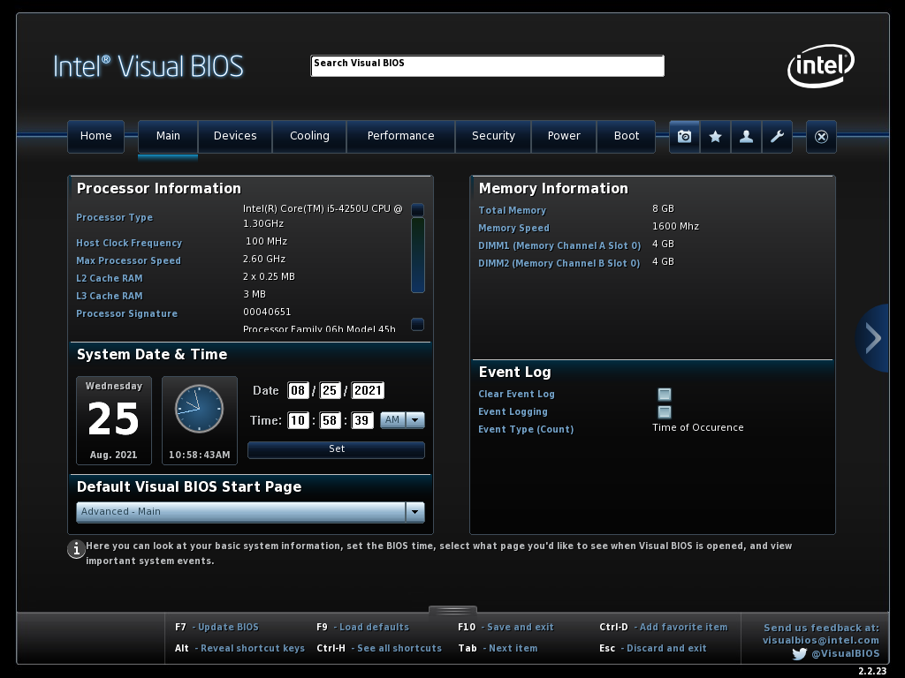
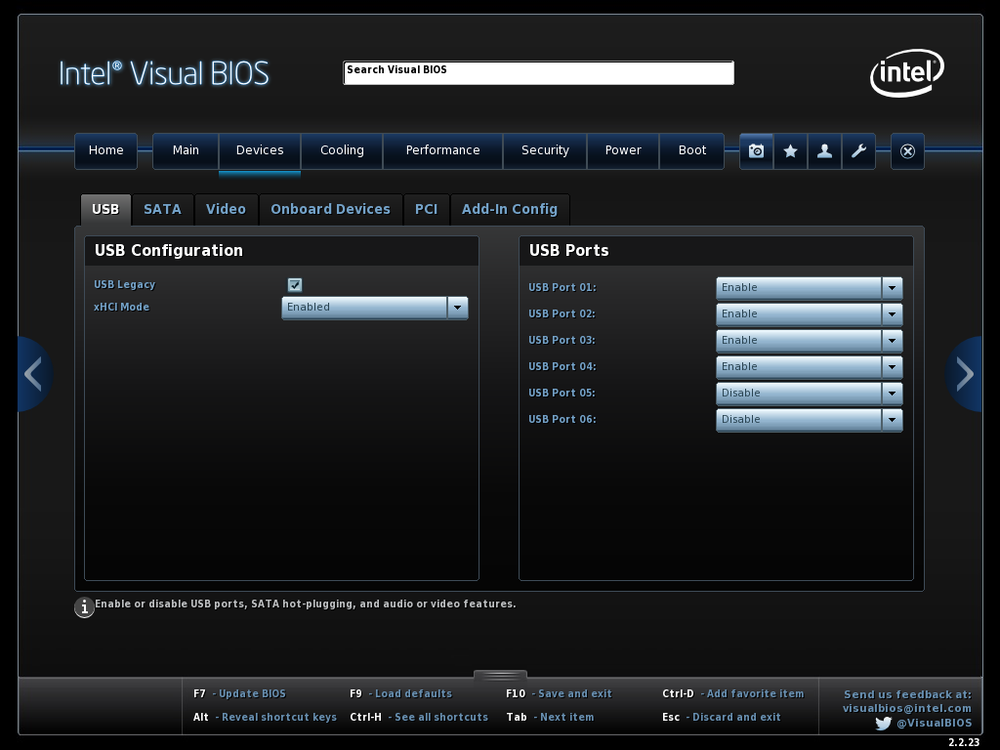
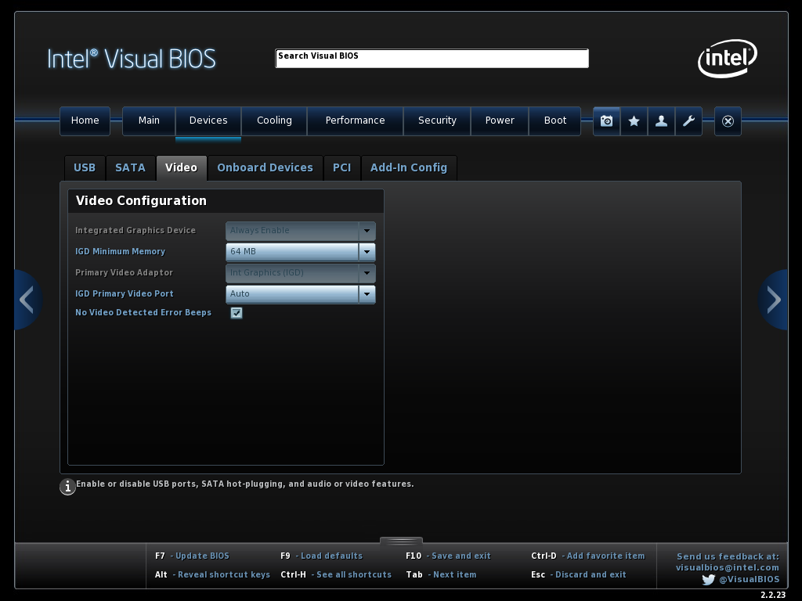
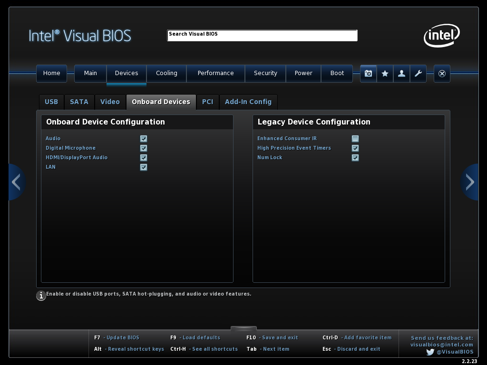
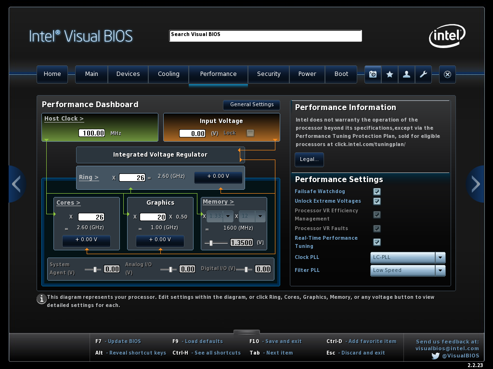
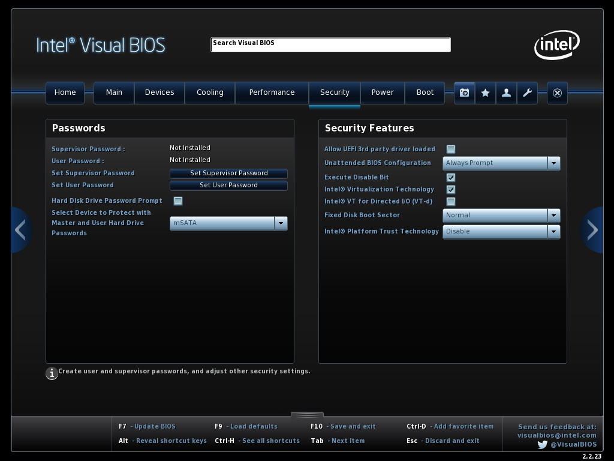
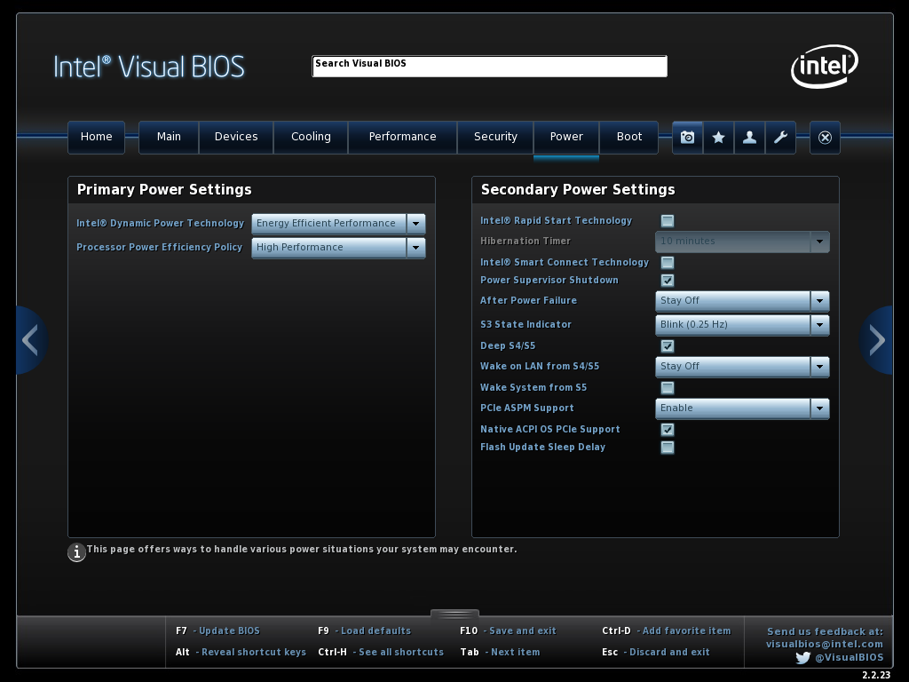
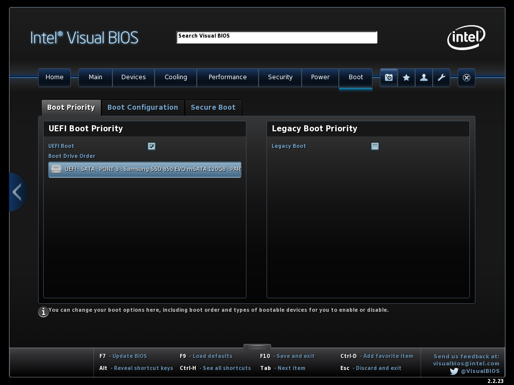
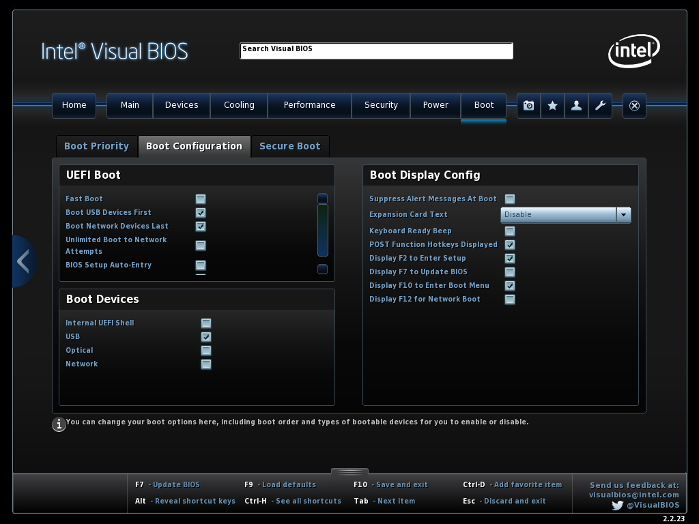
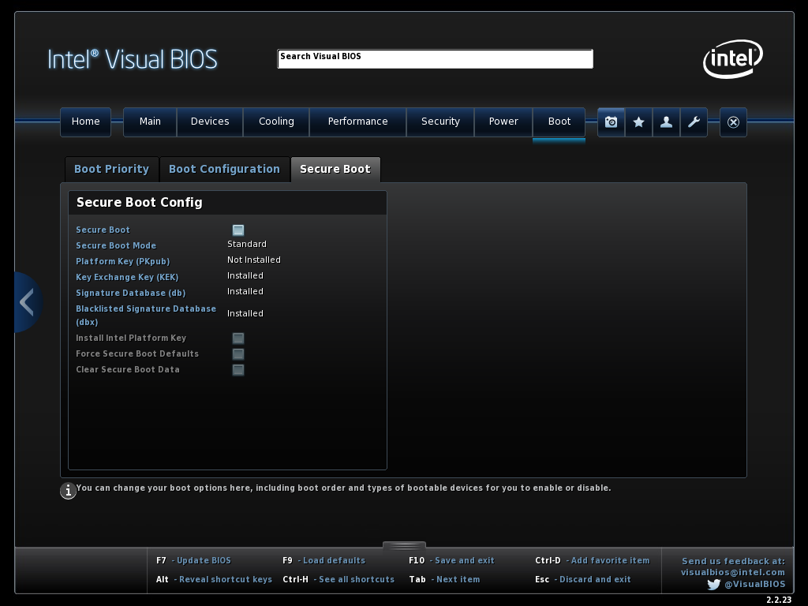

# Required BIOS Settings

There are some basic requirements regarding the BIOS settings of this NUC in order to be able to boot correctly to macOS via the UEFI bootloader. Press F2 to enter Visual BIOS Setup; press F9 to **load defaults;** then click on "Advanced" button and proceed to the following changes below, per section.

