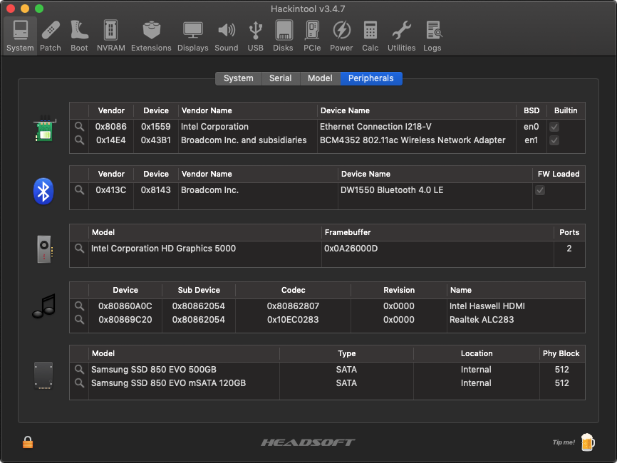
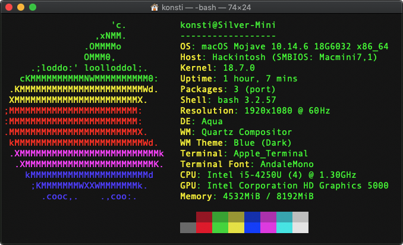
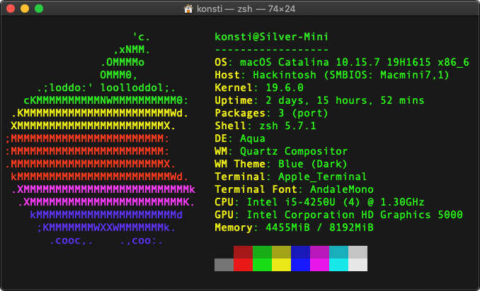

# Intel NUC D54250WYKH

This repository contains personal work and files, developed and maintained for a successful use with [OpenCore EFI bootloader](https://github.com/acidanthera/OpenCorePkg) on this specific Intel NUC model. There are **no** ready, pre-packaged EFI solutions provided; instead, the needed configuration and ACPI files are published for those interested in studying the code, while creating their own bootloader configurations.

**Table Of Contents**
- [Platform Generation](#platform-generation)
- [Product Generation: Wilson Canyon (2013)](#product-generation-wilson-canyon-2013)
- [Processor Generation: Haswell (2013)](#processor-generation-haswell-2013)
- [Geekbench](#geekbench)
- [Product Overview](#product-overview)
- [Compatible Models](#compatible-models)
- [Current Setup](#current-setup)
- [Required BIOS Settings](#required-bios-settings)
- [Active Configuration](#active-configuration)
- [Intel HD Graphics 5000 Properties](#intel-hd-graphics-5000-properties)
- [Original USB Port Mapping on NUC Chassis](#original-usb-port-mapping-on-nuc-chassis)
- [CPU Fan Reading Support](#cpu-fan-reading-support)
- [CPU Power Management](#cpu-power-management)

## Platform Generation

* Sandy Bridge = All Core ix-3xxx (HD Graphics 3000)
* Ivy Bridge = All Core ix-3xxx (HD Graphics 4000)
* **Haswell = All Core ix-4xxx (HD Graphics 4600)**
* Broadwell = All Core ix-5xxx (Iris Pro Graphics 6200)
* Skylake = All Core ix-6xxx (HD Graphics 5xx)
* Kaby Lake = All Core ix-7xxx (UHD/Iris Plus Graphics 6xx)
* Coffee Lake = All Core ix-8xxx (UHD/Iris Plus Graphics 6xx)

## Product Generation: Wilson Canyon (2013)

**Specifications:** see Intel website [here](https://ark.intel.com/content/www/us/en/ark/products/81164/intel-nuc-kit-d54250wykh.html)

**Downloads:** N/A (original [Intel website](https://www.intel.com/content/www/us/en/products/sku/81164/intel-nuc-kit-d54250wykh/downloads.html) no longer exists)

## Processor Generation: Haswell (2013)

**CPU:** Intel Core i5-4250U @ 1.30 GHz up to 2.60 GHz / 2 Cores / 4 Threads

**GPU:** Intel HD Graphics 5000 / 200 MHz up to 1.00 GHz / 3280x2000 @ 60Hz (maximum)

**Specifications:** see Intel website [here](https://ark.intel.com/content/www/us/en/ark/products/75028/intel-core-i54250u-processor-3m-cache-up-to-2-60-ghz.html)

## Geekbench

**V4 Scores:** https://browser.geekbench.com/v4/cpu/search?q=Core+i5-4250U

**V5 Scores:** https://browser.geekbench.com/v5/cpu/search?q=Core+i5-4250U

**V6 Scores:** https://browser.geekbench.com/v6/cpu/search?q=Core+i5-4250U

## Product Overview

## Compatible Models

Mac Model: **MacMini7,1** 
CPU: i5-4260U @ 1.40 GHz up to 2.70 GHz / 2 Cores / 4 Threads 
GPU: Intel HD Graphics 5000 
Everymac: https://everymac.com/ultimate-mac-lookup/?search_keywords=Macmini7,1 
Board ID: Mac-35C5E08120C7EEAF 
EFI Revision: MM71.88Z.0220.B00.1409291751 
EFI Revision: MM71.88Z.0224.B00.1708080033 
EFI Revision: MM71.88Z.0226.B00.1709290808 
EFI Revision: MM71.88Z.0232.B00.1806051659 
EFI Revision: MM71.88Z.0234.B00.1809171422 
EFI Revision: MM71.88Z.F000.B00.1812201005 
EFI Revision: MM71.88Z.F000.B00.1902151233 
EFI Revision: MM71.88Z.F000.B00.2002051745 
EFI Revision: MM71.88Z.F000.B00.2004161539 
EFI Revision: MM71.88Z.F000.B00.2012171735 
EFI Revision: MM71.88Z.F000.B00.2102221743 
EFI Revision: MM71.88Z.F000.B00.2106131851 
EFI Revision: MM71.88Z.F000.B00.2110271854 

## Current Setup

**Memory:** 8GB in 2 x 4GB PC3-12800 SO-DIMM (1.35V) 
**RAM:** Corsair "Vengeance" DDR3L @ 1600MHz CL9 (Model CMSX8GX3M2B1600C9) 
**WLAN:** Broadcom BCM94352HMB (AzureWave AW-CE123H) [[14e4:43b1]](http://pci-ids.ucw.cz/read/PC/14e4/43b1) 
**BTLE:** Broadcom BCM20702A0 (Combined Controller) [413c:8143] 
**SSD:** Samsung 850 EVO mSATA 120GB (Model MZ-M5E120BW) 
**SSD:** Samsung 850 EVO SATA III 500 MB (Model MZ-75E500B/EU) 
**Intel Product Compatibility Tool:** N/A (original [Intel website](https://compatibleproducts.intel.com/ProductDetails?EPMID=81164) no longer exists)

## Required BIOS Settings

For the essential but _required_ BIOS settings, as well as previous firmware releases, see [BIOS](BIOS/) folder.

## Active Configuration

* No CPU ID faking required, power management is native; MSR `0xE2` remains locked;
* External USB 3.0 ports work as expected; using generated `USBPorts.kext`;
* Internal USB 2.0 headers **not** used; they are disabled in BIOS;
* Intel graphics acceleration works as `0x0A260006` with [WhateverGreen](https://github.com/acidanthera/whatevergreen/releases);
* Analogue audio output works as layout ID `0x01` with [AppleALC](https://github.com/acidanthera/AppleALC/releases/);
* Digital audio output works right out-of-the-box (using a MiniDP to MiniDP cable);
* Embedded Intel LAN interface works with [IntelMausi](https://github.com/acidanthera/IntelMausi/releases);
* Replaced WLAN module works with [AirportBrcmFixup](https://github.com/acidanthera/AirportBrcmFixup/releases);
* Replaced BTLE module works with [BrcmPatchRAM](https://github.com/acidanthera/BrcmPatchRAM/releases);
* CPU fan readings work natively with [VirtualSMC](https://github.com/acidanthera/VirtualSMC/releases);
* Sleep/Wake both work without issues; see "Power" section in [Hackintool](https://github.com/headkaze/Hackintool/releases);
* Both mSATA and SSD SATA interfaces work with no effort nor kext needed.

For the complete list of all detected PCI hardware components and their respective addresses via `lspci -nn` command (in Ubuntu, loaded via USB) see [here](Various/lspci-nn.txt). This list was created with all devices enabled in BIOS and is used as a device "map" so that PCI IDs can be detected before tweaking the hardware (and BIOS) to run macOS.

## Intel HD Graphics 5000 Properties

The `AAPL,ig-platform-id` property set to `0x0A260006` is used for **WhateverGreen** to successfully enable acceleration on this graphics device [[8086:0a26]](http://pci-ids.ucw.cz/read/PC/8086/0a26). This ID represents the following properties and connectors:

| Properties             | Current Value(s)                        |
| ---------------------- | --------------------------------------- |
| Platform ID            | 0x0A260006 i.e. `0600260A` → `BgAmCg==` |
| Device ID              | 0x0A260000 i.e. `260A0000` → `JgoAAA==` |
| Mobile                 | Yes                                     |
| Stolen Memory          | 32 MB                                   |
| Framebuffer Memory     | 19 MB                                   |
| Video Memory (VRAM)    | 1536 MB                                 |
| Total Stolen Memory    | 52 MB                                   |
| Total Cursor Memory    | 1 MB                                    |
| Maximum Stolen Memory  | 116 MB                                  |
| Maximum Overall Memory | 117 MB                                  |
| Model Name             | Intel HD Graphics 5000                  |
| Camellia               | CamelliaDisabled (0)                    |
| Connector Count        | 3                                       |
| Pipe / Port #0         | Bus ID `0x00` Pipe `8` Connector LVDS   |
| Pipe / Port #1         | Bus ID `0x05` Pipe `9` Connector DP     |
| Pipe / Port #2         | Bus ID `0x04` Pipe `9` Connector DP     |
| Patching Required      | Yes (to change DP to HDMI connector)    |

:warning: **Important Note:** With recent macOS updates and latest `WhateverGreen.kext` there was a need to change the Platform ID from `0x0D220003` to `0x0A260006` as graphics acceleration exhibited problems:

| Properties             | Previous Value(s)                       |
| ---------------------- | --------------------------------------- |
| Platform ID            | 0x0D220003 i.e. `0300220D` → `AwAiDQ==` |
| Device ID              | 0x0A260000 i.e. No Change               |

Read more at [Intel® HD Graphics FAQs](https://github.com/acidanthera/WhateverGreen/blob/master/Manual/FAQ.IntelHD.en.md) on the **WhateverGreen** repository.

## Original USB Port Mapping on NUC Chassis

| USB 2.0 Port Name | USB 3.0 Port Name | Hardware Location  | Controller |
| ----------------- | ----------------- | ------------------ | ---------- |
| HP11 to HP18      | N/A               | Internal PR11 Hub  | EHCI       |
| HS01              | SS01              | Front RIGHT socket | XHCI       |
| HS02              | SS02              | Front LEFT socket  | XHCI       |
| HS03              | SS03              | Rear BOTTOM socket | XHCI       |
| HS04              | SS04              | Rear TOP socket    | XHCI       |
| HS07              | N/A               | Internal BTLE port | XHCI       |

The above active and working USB ports are listed in Hackintool, while the two *internal* (USB 2.0) headers and **Consumer IR** are all _disabled_ in [BIOS](BIOS/) and **all unused or non-referenced USB ports** are removed. In any other situation, ports such as HS05, HS06, HS08, HS09, HS10, USR1, USR2, SS05 and SS06 may be listed. All ports in the above table are defined in `USBPorts.kext` according to their _electrical_ connector.

However, one could also disable the EHCI controller for improved stability and compatibility (including sleep) by redirecting all USB connections to the XHCI controller. For this, we must use `SSDT-EHCI-OFF.aml` as well as the newer version of the generated `USBPorts.kext` in Hackintool. This also implies that there is **no longer** a need to rename the device `EHC1` to `EH01` etc. as before.

## CPU Fan Reading Support

Support for the NUC's embedded **Nuvoton NCT5577D** chipset was already available in [VirtualSMC](https://github.com/acidanthera/VirtualSMC/releases) (and more specifically `SMCSuperIO.kext`).

## CPU Power Management

With the injection of `SSDT-PLUG.aml` we can verify that Power Management is present and active as `X86PlatformPlugin` is attached to the first CPU core `CPU0` per the [Dortania Guide](https://dortania.github.io/OpenCore-Post-Install/universal/pm.html).

